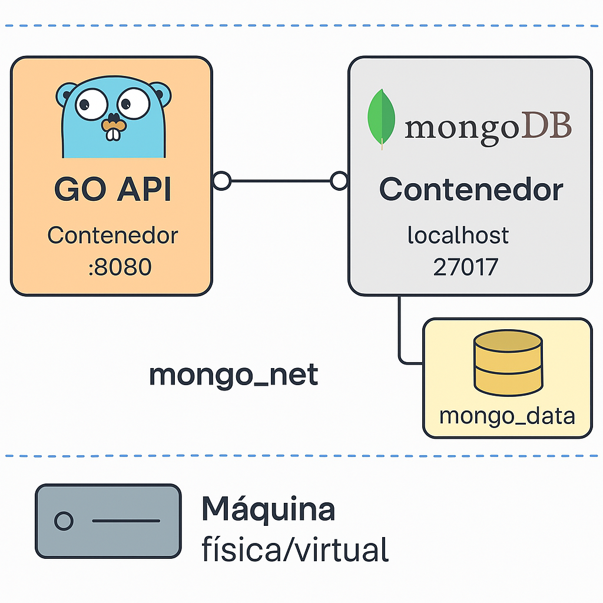

# 📚 Go Mongo App – Microservicio de Gestión de Estudiantes

Este proyecto es un microservicio RESTful desarrollado en Go, que gestiona operaciones CRUD sobre una colección de estudiantes en MongoDB. Está estructurado por capas (models, repositories, services, controllers) y se ha integrado con Docker para facilitar el despliegue.

---

## 🧩 Estructura del Proyecto

```
go-mongo-app/
├── controllers/
├── models/
├── repositories/
├── services/
├── Dockerfile
├── docker-compose.yml
├── main.go
├── go.mod / go.sum
└── README.md
```

---

## 🚀 Tecnologías Utilizadas

- **Go 1.20+**
- **MongoDB**
- **Mux Router**
- **Docker y Docker Compose**
- **Testify para pruebas unitarias**
- **Cobertura de pruebas con `go test -cover`**

---

## 🔧 Requisitos Previos

- [Go instalado](https://golang.org/dl/)
- [Docker](https://docs.docker.com/get-docker/)
- Cuenta en [Docker Hub](https://hub.docker.com)

---

## 🧪 Ejecutar la Aplicación Localmente

### 1. Clonar el proyecto
```bash
git clone https://github.com/HamiltonLopez/Golang-MongoDB.git
cd Golang-MongoDB
```

### 2. Levantar MongoDB con Docker (opcional si tienes uno local)
```bash
docker-compose up -d
```

Esto creará:
- MongoDB corriendo en `localhost:27017`
- Una red Docker para conexión entre contenedores.

---

## ▶️ Ejecutar el microservicio en local (sin Docker)

```bash
MONGO_URI="mongodb://localhost:27017" go run main.go
```

La API estará disponible en: `http://localhost:8080`

---

## 🧪 Probar la API con Postman

### 🚨 Actualizar estudiante por ID (PUT)

- **URL:** `http://localhost:8080/students/{id}`
- **Método:** `PUT`
- **Body (JSON):**
```json
{
  "name": "Laura",
  "age": 24,
  "email": "laura@test.com"
}
```

Otros endpoints disponibles:
- `GET /students`
- `GET /students/{id}`
- `POST /students`
- `DELETE /students/{id}`

---

## 🧪 Ejecutar pruebas y cobertura

### Pruebas con cobertura general:

```bash
MONGO_URI="mongodb://localhost:27017" go test ./... -cover
```

### Ver cobertura en HTML:

```bash
go test ./controllers -coverprofile=coverage.out
go tool cover -html=coverage.out
```

---


## 🖥️ Desplegar con Docker Compose

Este archivo levanta tanto el microservicio como MongoDB:

```bash
docker-compose up --build
```

El servicio estará disponible en:
- API: `http://localhost:8080`
- MongoDB: `localhost:27017`

---

## 🔒 Seguridad

- MongoDB se levanta en red Docker aislada (`mongo_net`).
- Se pueden agregar usuarios y contraseñas en el `docker-compose.yml` para más seguridad.
- MongoDB no está expuesto fuera del contenedor (opcional: `ports`).

---

## 💾 Volúmenes

MongoDB persiste datos en volumen `mongo_data`:

```yaml
volumes:
  mongo_data:
```

Esto asegura que los datos no se pierdan al reiniciar el contenedor.

---

## 🛠️ Script Bash de Automatización

Archivo `build_and_run.sh` (opcional):

```bash
#!/bin/bash

docker build -t go-mongo-app .
docker tag go-mongo-app hamiltonlg/hlopez:latest
docker push hamiltonlg/hlopez:latest
docker-compose up --build
```

---

## 📈 Diagrama de Infraestructura



Componentes:
- Contenedor API Go
- Contenedor MongoDB
- Red Docker (`mongo_net`)
- Volumen persistente (`mongo_data`)
- MongoDB protegido dentro de la red interna

---

## 🧠 Autor

**Hamilton López**  


---

## ✅ Estado del Proyecto

- [x] CRUD completo
- [x] Dockerfile y Docker Compose
- [x] Pruebas unitarias con cobertura
- [x] Imagen publicada en Docker Hub
- [x] Documentación y automatización
- [x] Pipeline CI/CD con GitHub Actions
- [x] Escaneo automático de vulnerabilidades
- [x] Despliegue automático con runner self-hosted

---

## 🔄 CI/CD con GitHub Actions

El proyecto cuenta con un robusto pipeline de CI/CD implementado con GitHub Actions que incluye:

### 🛠️ Pipeline Principal (docker-image.yml)

1. **Build y Escaneo de Seguridad**
   - Construcción de imagen Docker
   - Escaneo de vulnerabilidades con Trivy
   - Push a Docker Hub si pasa el escaneo

2. **Build y Pruebas**
   - Levanta MongoDB en contenedor para pruebas
   - Ejecuta pruebas unitarias
   - Ejecuta pruebas de integración
   - Construye y prueba con Docker Compose

3. **Release Automático**
   - Genera tags automáticos de versión
   - Publica la imagen en GitHub Container Registry
   - Crea releases en GitHub

### 🚀 Despliegue Automático (deploy.yml)

- Ejecuta en runner self-hosted
- Actualiza automáticamente la aplicación en producción
- Gestiona el ciclo de vida de los contenedores

### 🔐 Secretos Necesarios

Para que el pipeline funcione correctamente, se requieren los siguientes secretos en GitHub:

- `DOCKER_USERNAME`: Usuario de Docker Hub
- `DOCKER_PASSWORD`: Token de acceso de Docker Hub
- `GHCR_TOKEN`: Token de acceso para GitHub Container Registry

---
